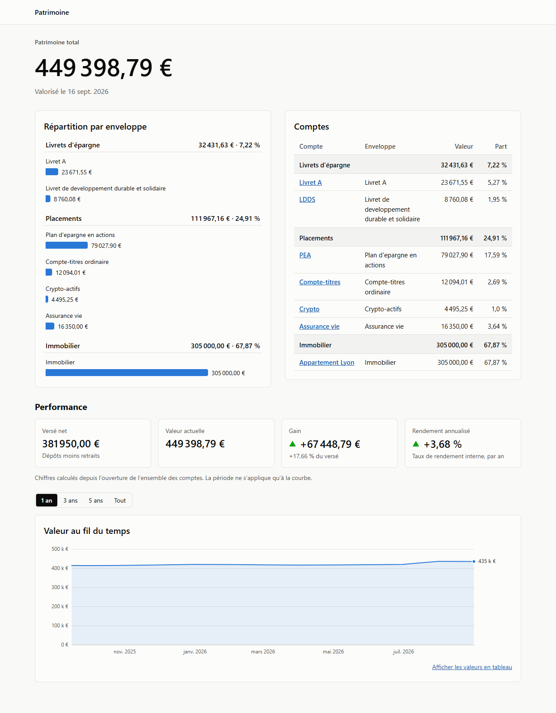
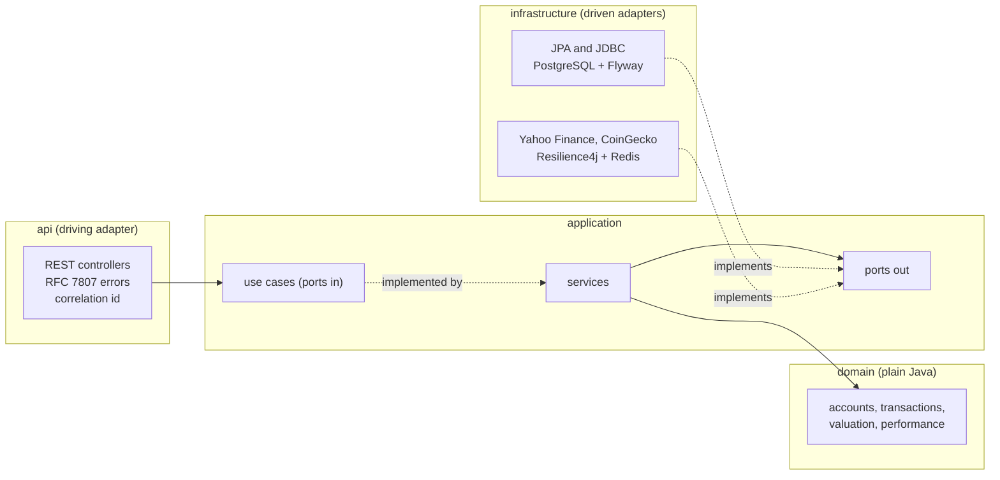
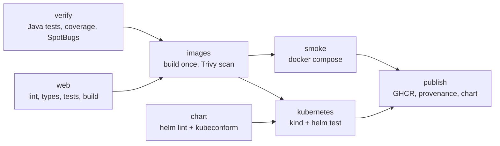

# patrimoine-api

[](https://github.com/Romain-E/wealth-tracker/actions/workflows/ci.yml)

A wealth tracker for French savings envelopes (Livret A, LDDS, PEA, compte-titres, assurance vie,
crypto, real estate). It enforces their regulatory rules, values each one the way it is really
valued, and reports what the money actually earned.

It is a complete delivery, not only an API:

- **Backend:** Java 21 and Spring Boot 3.5, with a hexagonal architecture enforced by tests.
- **Data:** PostgreSQL with Flyway migrations; Redis as a price cache; live market prices behind
  circuit breakers.
- **Frontend:** a typed React app.
- **Delivery:** container images, a Helm chart tested on a real Kubernetes cluster, and a CI
  pipeline that publishes the exact artefacts it tested.



## Contents

- [Run it](#run-it)
- [What the domain gets right](#what-the-domain-gets-right)
- [Architecture](#architecture)
- [API](#api)
- [Live prices, and what happens when they fail](#live-prices-and-what-happens-when-they-fail)
- [Operations](#operations)
- [Delivery: image, chart, pipeline](#delivery-image-chart-pipeline)
- [Tests](#tests)
- [Web application](#web-application)
- [Decisions and limits](#decisions-and-limits)
- [Repository layout](#repository-layout)

## Run it

The only requirement is Docker.

```sh
docker compose up --build
```

| What                           | Where                                  |
| ------------------------------ | -------------------------------------- |
| Web application                | http://localhost:3000                  |
| API                            | http://localhost:8080/api/v1/portfolio |
| API documentation (Swagger UI) | http://localhost:8080/swagger-ui.html  |
| Health and build information   | http://localhost:8081/actuator/health  |

- **Demo data:** the stack starts with a demo portfolio of seven accounts.
- **Port conflicts:** only these three ports are published. If one is taken, move it with
  `WEB_PORT`, `API_PORT` or `MANAGEMENT_PORT`, for example `API_PORT=18080 docker compose up`.
  PostgreSQL and Redis stay on the Compose network, so local instances do not get in the way.
- **Kubernetes:** to deploy on a local cluster instead, see
  [Kubernetes with Helm](#kubernetes-with-helm).

### Development

| Task                                                               | Command                                                   |
| ------------------------------------------------------------------ | --------------------------------------------------------- |
| Full build: unit tests, integration tests, coverage gate, SpotBugs | `./mvnw verify spotbugs:check`                            |
| Format the Java code                                               | `./mvnw spotless:apply`                                   |
| Run the API against a local Postgres                               | `./mvnw spring-boot:run -Dspring-boot.run.profiles=local` |
| Web app with hot reload, proxying `/api` to port 8080              | `cd web && npm ci && npm run dev`                         |

Integration tests start their own PostgreSQL and Redis through Testcontainers, so Docker must be
running. On Windows, use `.\mvnw.cmd`.

## What the domain gets right

Most portfolio trackers treat every account as a list of positions multiplied by prices. French
envelopes do not work that way, and the domain model says so.

| Envelope                   | How it is valued                          | Rules enforced                                                                                    |
| -------------------------- | ----------------------------------------- | ------------------------------------------------------------------------------------------------- |
| Livret A, LDDS             | Interest under the _règle des quinzaines_ | Payment ceiling (22 950 € / 12 000 €) on **net** payments; interest may take the balance above it |
| PEA                        | Positions at market price                 | Ceiling of 150 000 € on **gross** payments; only EU equities, ETFs and funds, so no crypto        |
| Compte-titres              | Positions at market price                 | Equities, ETFs and funds                                                                          |
| Crypto                     | Positions at market price                 | Crypto-assets only                                                                                |
| Assurance vie, real estate | Latest statement or appraisal             | No market price is invented                                                                       |

Some rules deserve a closer look:

- **The _règle des quinzaines_** ([QuinzaineInterestCalculator](src/main/java/fr/patrimoine/domain/valuation/QuinzaineInterestCalculator.java)).
  Regulated savings do not earn interest daily. Interest is earned per fortnight, starting on the
  1st and the 16th. A deposit made on the 2nd earns nothing until the 16th, and a withdrawal made on
  the 14th loses the fortnight that began on the 1st. Interest is added to the balance once a year.
  Rates change over time and come from a versioned table.
- **Envelope rules live in one place** ([AccountType](src/main/java/fr/patrimoine/domain/model/AccountType.java)).
  Family (savings, investments or property), valuation method, ceiling basis, ceiling and eligible
  instruments are all defined in one table.
  Adding an envelope means adding one row, not updating `switch` statements across the code.
- **Performance reports two figures that answer different questions**
  ([Xirr](src/main/java/fr/patrimoine/domain/performance/Xirr.java)):
  - **Simple gain** is current value minus net amount paid in.
  - **Annualised return (XIRR)** is the internal rate of return of the dated cash flows. A euro
    invested ten years ago counts for ten years; a euro invested last month counts for a month.
  - **How XIRR is solved:** Newton-Raphson, falling back to bisection when it would diverge. A
    realistic deposit pattern can otherwise produce a NaN in production.
- **Money is `BigDecimal` and currency-aware.** An ArchUnit rule rejects `double` or `float` for
  any monetary value.
- **Rules are checked before anything is written.** A deposit over the ceiling, a sale of more
  shares than are held, or a crypto purchase in a PEA each return an HTTP 422 that names the broken
  rule.

## Architecture

A hexagonal architecture (ports and adapters) in a single Maven module. The boundaries are
enforced by [ArchitectureTest](src/test/java/fr/patrimoine/architecture/ArchitectureTest.java)
rather than by module boundaries, so a violation fails the build with a message that explains the
rule.



The rules that ArchUnit enforces:

- The domain depends on no framework: no Spring, no JPA, no Jackson.
- Dependencies point inward only; the application layer knows nothing of web or persistence.
- Use cases and driven ports are interfaces, and controllers reach services only through them.
- JPA entities never leave the persistence adapter. They are mapped to and from domain objects,
  so the domain keeps its invariants and the database schema can change without touching it.
- No floating-point money, and no `java.util.Date`.

**Why one module and not several Maven modules:** the same guarantees, with less build machinery
for a codebase of this size. The rules also check things module boundaries cannot, such as the
money and date rules.

## API

All endpoints are under `/api/v1`. The OpenAPI 3.1 contract is served at `/v3/api-docs`.

| Method | Path                                   | Purpose                                                             |
| ------ | -------------------------------------- | ------------------------------------------------------------------- |
| `GET`  | `/portfolio`                           | Total wealth, every account, allocation by envelope                 |
| `GET`  | `/accounts/{id}`                       | One account: positions at market price, remaining payment allowance |
| `POST` | `/accounts/{id}/transactions`          | Record a deposit, withdrawal, purchase or sale                      |
| `PUT`  | `/accounts/{id}/valuations/{date}`     | Record a statement or appraisal (assurance vie, real estate)        |
| `GET`  | `/performance?from=&to=`               | Consolidated gain, XIRR and value over time                         |
| `GET`  | `/accounts/{id}/performance?from=&to=` | The same for one account                                            |

Every endpoint follows the same conventions:

- **Errors** use [RFC 7807](https://www.rfc-editor.org/rfc/rfc7807) (`application/problem+json`).
  Each error has a stable `code`, per-field `errors` for validation failures, and the
  `correlationId` of the request.
- **Correlation IDs:** every response carries an `X-Correlation-Id` header. If the caller sends
  one, it is reused. The ID also appears on every log line of the request, so a user can report an
  error with an ID that finds the matching logs.
- **The contract is precise enough to generate a client:**
  - transaction types are a discriminated union;
  - nullable fields are declared nullable, and response fields are declared required;
  - [OpenApiContractIT](src/test/java/fr/patrimoine/api/OpenApiContractIT.java) fails when the
    served contract differs from the committed [web/openapi.json](web/openapi.json).

Example: a deposit that would exceed the Livret A ceiling.

```sh
curl -i http://localhost:8080/api/v1/accounts/00000000-0000-4000-a000-000000000001/transactions \
  -H 'Content-Type: application/json' \
  -d '{"type":"DEPOSIT","date":"2026-09-16","amount":{"amount":5000.00,"currency":"EUR"}}'
```

```http
HTTP/1.1 422
Content-Type: application/problem+json
X-Correlation-Id: 5f0c…

{
  "type": "/problems/deposit-ceiling-exceeded",
  "title": "Unprocessable Entity",
  "status": 422,
  "detail": "Livret A payments are capped at …; this payment would bring them to …",
  "code": "deposit-ceiling-exceeded",
  "correlationId": "5f0c…"
}
```

## Live prices, and what happens when they fail

Positions are priced from two sources:

- **Yahoo Finance** for equities and ETFs. The ISIN is resolved to a euro-area listing, with
  hand-written overrides stored in the database.
- **CoinGecko** for crypto-assets.

Both are free, public services with no guarantees, so the application is designed to handle their
failures:

- **Timeouts:** 2 s to connect and 3 s to read, so a slow provider cannot hold request threads.
- **Retries and circuit breakers:** each provider has its own retry and circuit breaker
  (Resilience4j). A Yahoo outage does not affect crypto prices.
- **Fallback:** when a provider fails, the last stored price is used and marked **stale**. The web
  app shows that price with a warning instead of an error.
- **Cache:** prices are cached in Redis for 15 minutes, and a scheduled job refreshes them before
  they expire. Redis is optional: if it is down, a lookup gives up after 500 ms and fetches the
  price directly.
- **Currency:** a price in another currency is dropped rather than converted, because there is no
  FX source. The position is then shown as unpriced.
- **Kill switch:** `patrimoine.quotes.live-prices=false` stops all calls to providers and serves
  stored prices only. CI uses it so that a deployment test does not depend on a third-party site.

## Operations

- **Probes with different meanings:**
  - _Liveness_ checks only the application itself. A database outage is not fixed by a restart,
    and including it would restart every pod in a loop.
  - _Readiness_ also checks the database. Redis and the price providers are deliberately left
    out: failing readiness because of them would remove every pod at once and turn a degraded
    dependency into a full outage.
- **A `DEGRADED` health status.** It means the application is serving, but with stale or uncached
  prices. It is reported with HTTP 200, so nothing restarts or stops routing traffic because of it.
- **A separate management port (8081).** Health and build information are not part of the
  Kubernetes Service or the Ingress, so they are not reachable from the internet. The kubelet
  still probes them.
- **Graceful shutdown.** A `preStop` pause lets endpoint removal propagate, then Spring lets
  requests in flight finish within the pod's grace period. An upgrade under load was checked to
  drop no requests.
- **Waiting for the database at startup.** Flyway retries its connection with back-off, so an
  API that starts before its database waits instead of crashing.
- **JSON logs** (the `json-logs` profile, on by default in the chart), with the correlation ID as
  a field.
- **Build information.** `/actuator/info` reports the Git commit and the build time.

## Delivery: image, chart, pipeline

### Container images

The [API Dockerfile](Dockerfile):

- uses a multi-stage build;
- caches Maven dependencies in a BuildKit cache mount, outside any image layer;
- orders the Spring Boot layers so that a release usually changes only the small application layer;
- runs as a fixed, numeric, non-root user, with files owned by root;
- sizes the JVM heap from the container's memory limit (`MaxRAMPercentage`), and exits on
  `OutOfMemoryError` so the orchestrator restarts a clean process.

The [web Dockerfile](web/Dockerfile) builds the React app with Node, then serves it with
unprivileged nginx. nginx adds a strict Content-Security-Policy and other security headers,
caches versioned assets forever, and forwards `/api` to the API with the correlation ID.

### Kubernetes with Helm

The [chart](charts/patrimoine-api) deploys the API and the web app. When the Ingress is enabled,
`/api` goes to the API and everything else to the web app.

- **Configuration is validated.** A JSON schema rejects mistyped values at install time.
- **Credentials:** the database password comes from an existing Secret (External Secrets, Sealed
  Secrets…), so it never appears in values files or the Helm release history.
- **Pod security:** the pods run as non-root with a read-only root filesystem, drop all Linux
  capabilities, and use the default seccomp profile.
- **Resources:** memory request equals the limit. There is no CPU limit, because a limit throttles
  the JVM even when the node has idle cores.
- **Availability:** a PodDisruptionBudget, a spread of replicas across nodes, and an optional
  autoscaler (HPA).
- **Checking a release:** `helm test` checks the API, the web page and the API call through nginx
  from inside the cluster.

For a self-contained demo on a local cluster ([kind](https://kind.sigs.k8s.io/)), with an
in-cluster PostgreSQL and Redis:

```sh
kind create cluster --name patrimoine
docker build -t patrimoine-api:local .
docker build -t patrimoine-web:local web
kind load docker-image patrimoine-api:local patrimoine-web:local --name patrimoine
helm install patrimoine-api charts/patrimoine-api -f charts/patrimoine-api/values-demo.yaml
helm test patrimoine-api
kubectl port-forward service/patrimoine-api-web 3000:80   # then open http://localhost:3000
```

### CI/CD

[`.github/workflows/ci.yml`](.github/workflows/ci.yml):



- **Built once, published as tested.** Each image is built once and saved as an archive. The
  smoke test, the Kubernetes deployment and the publish job all use those same archives, so what
  reaches the registry is exactly what was tested.
- **Published to GHCR with the workflow's own `GITHUB_TOKEN`,** so no registry secret is stored.
  - Every image is tagged with its commit.
  - The default branch also moves `latest`.
  - A `v1.2.3` tag adds `1.2.3` and `1.2`, and publishes the chart as an OCI artefact with the
    same version.
- **Signed build provenance.** You can check an image before deploying it:
  `gh attestation verify oci://ghcr.io/romain-e/patrimoine-api:latest --owner romain-e`.
- **Supply chain:**
  - every action is pinned to a commit SHA;
  - permissions are read-only by default;
  - Trivy fails the build on any critical vulnerability that has a fix;
  - downloaded tools are checked against their published checksums;
  - Dependabot keeps Maven, npm, actions and base images up to date.

## Tests

| Layer           | What                                                                                                                            | Tooling                                                         |
| --------------- | ------------------------------------------------------------------------------------------------------------------------------- | --------------------------------------------------------------- |
| Domain          | Valuation, quinzaines, ceilings, XIRR edge cases                                                                                | JUnit 5, AssertJ; coverage gate of 85 % lines and 75 % branches |
| Application     | Use cases, with their ports mocked                                                                                              | JUnit 5, Mockito                                                |
| Web layer       | Controllers, validation, problem details, correlation ID                                                                        | MockMvc                                                         |
| Persistence     | Repositories and migrations against a real PostgreSQL 17; the demo seed checked against the domain rules                        | Testcontainers                                                  |
| Price providers | HTTP clients against stubbed responses: symbol lookup, unknown instruments, prices in other currencies, throttling and failures | WireMock                                                        |
| End to end      | Live prices with retries, circuit breakers and Redis; probes; the full API; the OpenAPI contract                                | Testcontainers (PostgreSQL, Redis)                              |
| Architecture    | The hexagon's rules                                                                                                             | ArchUnit                                                        |
| Web app         | Formatting helpers, chart scales, pages rendered against a mocked API                                                           | Vitest, Testing Library, MSW                                    |

In total, 195 unit tests and 39 integration tests on the backend, plus the web app's tests.
Static analysis runs with SpotBugs and Spotless on the Java side, and with ESLint
(`strictTypeChecked`) and Prettier on the web side.

## Web application

[`web/`](web) contains the frontend, built with Vite, React 19, TypeScript in strict mode,
TanStack Query and React Router.

- **Typed from the contract.** The API client is generated from `openapi.json`, so a breaking API
  change fails the frontend's type check in CI rather than failing in a browser.
- **Charts:**
  - hand-written SVG, no chart library;
  - the value axis starts at zero, and a period picker is kept in the URL;
  - a keyboard-navigable crosshair, and every chart can be switched to a table.
- **Accessibility:** a skip link, labelled meters and bars, status shown with an icon as well as a
  colour, support for forced-colours mode, and a layout that works at 375 px.
- **Errors carry the correlation ID** shown to the user, so a support request can be traced to
  the matching logs.

## Decisions and limits

Choices made deliberately, with what they cost:

- **Separate JPA entities and domain objects, with mappers.** It adds code, but persistence
  concerns (lazy loading, proxies, no-arg constructors) stay out of the domain.
- **XIRR, not time-weighted return (TWR).** TWR judges a fund manager by removing the effect of
  when deposits happen. XIRR answers what a saver wants to know: what _their_ money earned.
- **Unofficial Yahoo Finance endpoint.** It is free and needs no key, but it can change without
  notice. The circuit breakers, stale fallback and kill switch exist for that reason, and the
  provider sits behind a port, so it can be replaced.

What this project does not do yet:

- **No authentication.** It models a single user's portfolio. Before exposing it, the next step
  would be an OIDC resource server (Spring Security) with accounts scoped to their owner.
- **No FX conversion.** Everything is in euros, and prices in other currencies are dropped.
- **Regulated savings rates and ceilings are as of 2026.** Rates come from a versioned table;
  ceilings are in code, next to their tests.

## Repository layout

```text
src/main/java/fr/patrimoine/
  domain/           accounts, transactions, valuation strategies, performance (plain Java)
  application/      use cases (port/in), driven ports (port/out), services
  api/              REST controllers, DTOs, RFC 7807 handler, correlation-id filter, OpenAPI
  infrastructure/   persistence (JPA, JDBC), quotes (HTTP clients, Resilience4j, Redis)
src/main/resources/
  db/migration/     Flyway schema migrations
  db/seed/          demo portfolio (profile `demo` only)
web/                React application, nginx configuration, openapi.json
charts/             Helm chart
compose.yaml        local stack
.github/            CI pipeline and Dependabot
```
